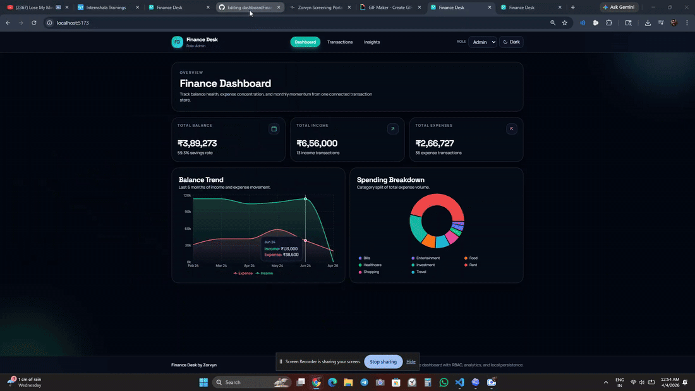

Link https://dashboard-finance-ui-git-main-shivanshsingh05102000s-projects.vercel.app/insights

# Finance Dashboard UI - Zorvyn Assessment

A modern, responsive finance dashboard built with React, Tailwind CSS, Context API, and Recharts.

## Demo



## Quick Start

1. Install dependencies:
```bash
npm install
```
2. Start development server:
```bash
npm run dev
```
3. Build for production:
```bash
npm run build
```
4. Preview production build:
```bash
npm run preview
```

## Features

- Dashboard overview with live summary cards:
  - Total Balance
  - Total Income
  - Total Expenses
- Recharts visualizations driven from one shared transaction store:
  - Area chart: balance trend over recent months
  - Pie chart: expense split by category
  - Bar chart: monthly income vs expense comparison
- Transactions page:
  - Debounced search (description/category)
  - Filter by transaction type
  - Filter by category
  - Sort by date/amount
  - Responsive table + mobile card layout
- RBAC (Role Based Access Control):
  - Viewer: read-only experience
  - Admin: Add, Edit, Delete, and Export CSV
- Local persistence:
  - Transactions persisted in localStorage
  - Role preference persisted in localStorage
  - Theme preference persisted in localStorage
- Dark/Light theme toggle with polished contrast in both modes

## RBAC Demo Guide

1. Open the role switcher in navbar.
2. Set role to `Viewer`:
   - Add/Edit/Delete/Export controls are hidden.
   - Data is read-only.
3. Set role to `Admin`:
   - `Add Transaction` button is available.
   - Edit/Delete actions appear on each transaction row/card.
   - `Export CSV` is enabled.
4. Add or edit a transaction and verify:
   - Dashboard totals update immediately.
   - All charts update from the same store.
   - Insights page reflects the change.

## Project Structure

```text
src/
  components/
    BalanceTrendChart.jsx
    Footer.jsx
    InsightTiles.jsx
    Navbar.jsx
    RoleSwitcher.jsx
    SpendingPieChart.jsx
    SummaryCards.jsx
    ThemeToggle.jsx
    TransactionModal.jsx
    TransactionTable.jsx
  context/
    AppContext.jsx
  data/
    mockTransactions.js
  pages/
    Dashboard.jsx
    Insights.jsx
    Transactions.jsx
  utils/
    finance.js
  App.jsx
  index.css
  main.jsx
```

## Tech Choices

- React + Vite: fast iteration and clean component architecture
- Tailwind CSS: rapid styling and responsive utility workflow
- Context API + useReducer: centralized global store without Redux overhead
- Recharts: reusable charting primitives for React dashboards

## Notes

- Seeded with 48 mock transactions across multiple months and categories.
- All metrics and charts are computed from the shared transaction source.
- Works across desktop and mobile widths (including compact 375px layouts).
