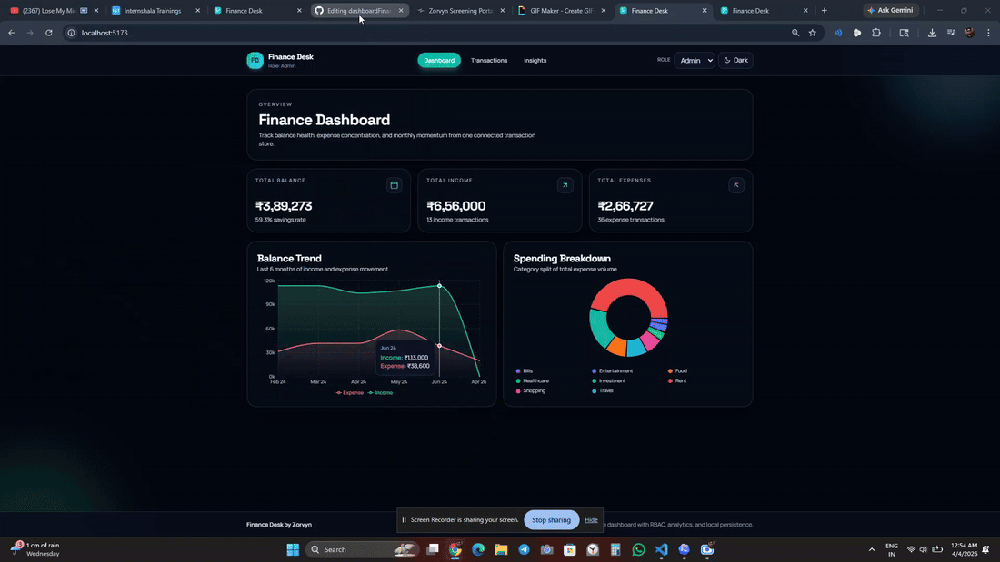

<h1 align="center">Finance Dashboard</h1>

<p align="center">
  <b>A React dashboard for tracking balance, transactions and spending insights</b><br/>
  Role-based UI · charts · search, filter &amp; sort · light/dark · localStorage persistence
</p>

<p align="center">
  
  
  
  
</p>

<p align="center">
  <a href="https://dashboard-finance-ui.vercel.app"><b>Live demo →</b></a>
</p>

---

Every number on screen — the summary cards, both charts and the insights panel —
is derived from one shared transaction store, so filtering or editing a
transaction updates the whole dashboard consistently. State is handled with
Context +  and persisted to localStorage.

<sub>Originally built as a frontend assessment for Zorvyn.</sub>

## Demo



## What I Built

- Dashboard overview with summary cards (balance, income, expenses)
- Time-based visualization (income vs expense trend over recent months)
- Categorical visualization (expense breakdown by category)
- Transactions section with search, filters, sorting, and responsive layout
- Frontend role simulation:
  - Viewer: read-only
  - Admin: add, edit, delete, export CSV
- Insights section:
  - Highest spending category
  - Monthly income vs expense
  - Savings and activity metrics
- State handled via Context + useReducer, with localStorage persistence
- Light/dark mode and mobile-friendly design

## Requirement Coverage

1. Dashboard Overview: Implemented with cards + charts.
2. Transactions Section: Date, amount, category, type + search/filter/sort.
3. Basic Role Based UI: Viewer/Admin switch in navbar.
4. Insights Section: Top category, monthly comparison, quick observations.
5. State Management: Global context for transactions, role, theme, filters.
6. UI/UX: Responsive cards/table, empty states, readable themes.

## Tech Stack

- React + Vite
- Tailwind CSS
- Context API + useReducer
- Recharts

## Run Locally

```bash
npm install
npm run dev
```

Build for production:

```bash
npm run build
npm run preview
```

## Project Structure

```text
src/
  components/
  context/
  data/
  pages/
  utils/
  App.jsx
  index.css
  main.jsx
```

## Notes

- Mock data is preloaded so charts and filters can be tested immediately.
- All computed numbers/charts are derived from the same transaction dataset.
- Theme, role, and transaction list are stored in localStorage.

## If I Had More Time

- Add unit tests for reducers and finance utility methods.
- Add pagination/virtualization for very large transaction lists.
- Add optional API mode (mock server + loading/error states).
